# Model Architecture Reference

This page documents every model architecture developed in the experimentation pipeline, from the first baseline proof-of-concept through to the current **SOTA production model**. All architectures operate on the same core problem: given a sliding window of RF measurements across a candidate cell set, predict the optimal target cell for a handover 5 steps into the future.

> **Production model:** `models/best_ray_id_crossformer.keras`  
> **Problem type (production):** 5-step future horizon multi-class cell selection  
> **Problem type (baseline only):** Single-step (current-instant) selection — `notebooks/modeling/01_temporal_deepset.ipynb` only

---

## Architecture Lineage Overview

```text
Exp 01 — Temporal DeepSet (baseline, single-step)
      │
      ├─► Exp 02 — SpatioTemporal DeepSet Production (5-step, multi-horizon)
      │
      ├─► Exp 03 — MTL Set Transformer (multi-task, 5-step)
      │
      ├─► Exp 04 — 6G Predictive Set Transformer (Optuna-tuned, 5-step)
      │
      ├─► Exp 05 — Strategic DeepSet (context injection, 5-step)
      │
      ├─► Exp 06 — SOTA Ray-Tracing Fine-Tune (MTL backbone → ray domain)
      │
      └─► Exp 07 — Ray-ID CrossFormer ★ SOTA / Production (5-step)
```

---

## Exp 01 — Temporal DeepSet (Baseline)

> **Notebook:** `notebooks/modeling/01_temporal_deepset.ipynb`  
> **Checkpoint:** `models/best_temporal_deepset.keras`  
> **⚠️ Important:** This is a **single-step cell selection** experiment — it predicts the best cell at time *t+1*, not a future horizon. All subsequent experiments (02–07) target 5-step future prediction for production use.

### Architecture

The Temporal DeepSet stacks a per-cell LSTM temporal encoder with a DeepSet permutation-invariant aggregation, making it robust to variable numbers of neighbor cells and to the arbitrary ordering of the candidate set.

```text
Input: (K, T, F)  — K cells, T=25 timesteps, F=3 features (RSRP, SINR, Load)
    │
    ├─ [Per-Cell LSTM]  (shared weights across K)  →  φ(xᵢ) ∈ ℝ^64
    │
    ├─ [MaskedGlobalAveragePooling]   →  ρ-aggregation over valid cells
    │
    └─ [Classifier MLP]  →  logits ∈ ℝ^K
```

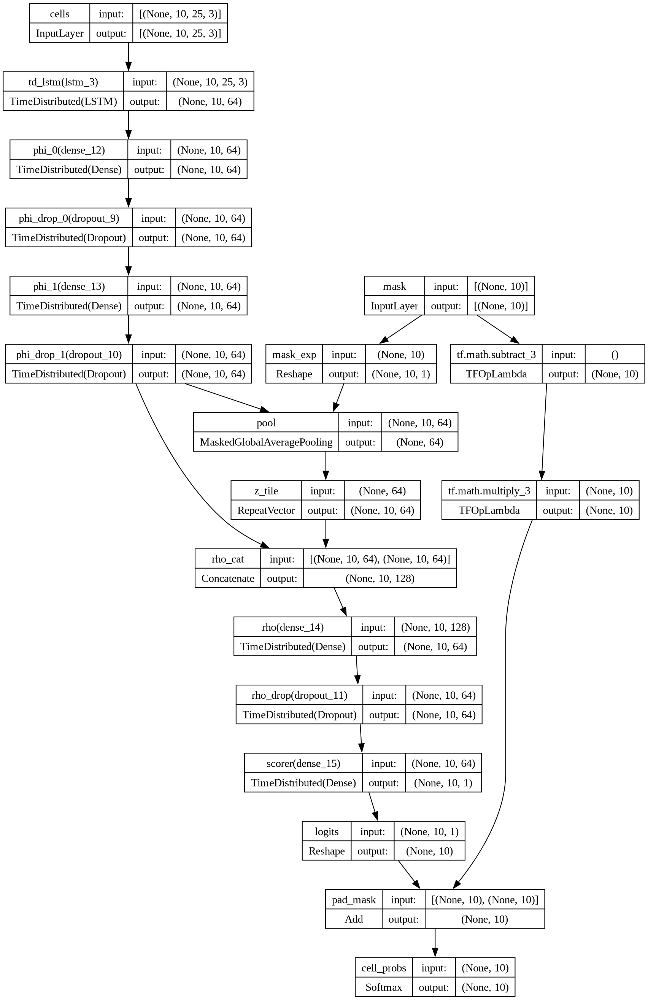

### Hyperparameters

| Parameter | Value |
|---|---|
| `OBS_STEPS` | 25 |
| `MAX_CELLS` | 10 |
| `LSTM_UNITS` | 64 |
| `PHI_DIM` | 64 |
| `PHI_LAYERS` | 2 |
| `DROPOUT` | 0.25 |
| `BATCH_SIZE` | 128 |
| `LR_INIT` | 1e-3 |
| Loss | Focal (γ=2.0, α=0.25) + Label Smoothing 0.1 |

### Results (Single-Step — Baseline Only)

| Metric | Value |
|---|---|
| **Test Top-1** | **99.82 %** |
| **Test Top-3** | **100.0 %** |
| **Test Top-5** | **100.0 %** |

> These near-perfect numbers reflect the **single-step** nature of this experiment: the model selects the best *current* cell, which is an easier problem. This is **not** the 5-step production task.

### Training Curves

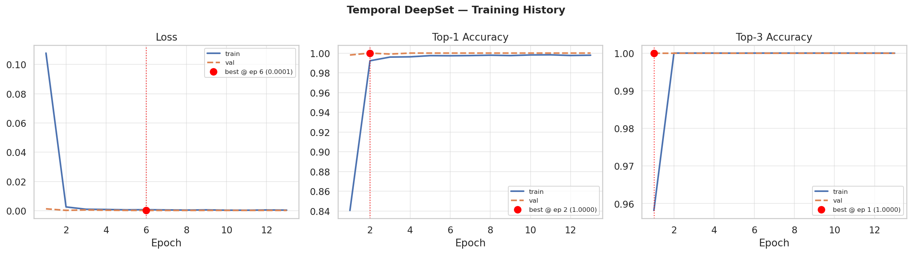

### Confusion Matrix

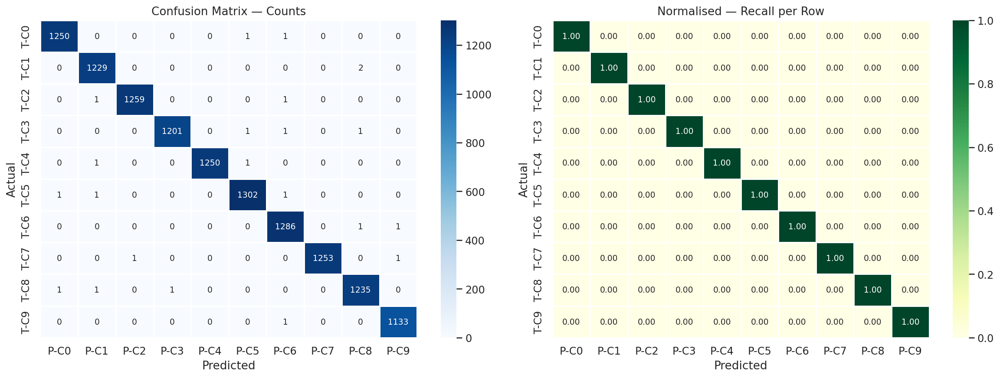

---

## Exp 02 — SpatioTemporal DeepSet Production

> **Notebook:** `notebooks/modeling/02_temporal_deepset_production.ipynb`  
> **Architecture class:** `SpatioTemporalDeepSet`  
> **Checkpoint:** `models/best_temporal_deepset.keras`

This version extends the baseline to the 5-step future-horizon prediction problem. A multi-task decoder simultaneously predicts:
- the optimal cell at the **current instant** (auxiliary task, easy),
- the optimal cell at **each of the next 5 steps** (primary task),
- future **RSRP / SINR / Load signal regression** (auxiliary regression head).

```text
Input: (K, T=200, F=5)
    │
    ├─ [Per-Cell LSTM (128 units)] → cell embedding φᵢ ∈ ℝ^64
    │
    ├─ [Attend module] → context-aware aggregation ρ ∈ ℝ^128
    │
    ├─ [Now-Decoder MLP] → cell_now logits ∈ ℝ^K         (auxiliary)
    │
    ├─ [Future-Decoder LSTM (256)] → hidden per horizon
    │       └─ [Scorer] → logits ∈ ℝ^(H×K)              (primary, H=5)
    │
    └─ [Signal Regression Head] → (RSRP, SINR, Load) × H  (auxiliary)
```

### Results (5-Step Future Prediction)

| Horizon | Top-1 |
|---------|-------|
| t+1 | 64.98 % |
| t+2 | 57.94 % |
| t+3 | 54.26 % |
| t+4 | 52.29 % |
| **t+5** | **51.20 %** |
| **avg** | **56.13 %** |

| Metric | Value |
|---|---|
| RSRP MAE | 5.56 dBm |
| SINR MAE | 5.14 dB |
| Load MAE | 0.072 |

### Training Curves

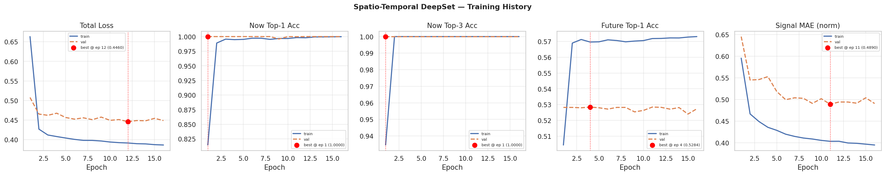

### Per-Step Future Accuracy

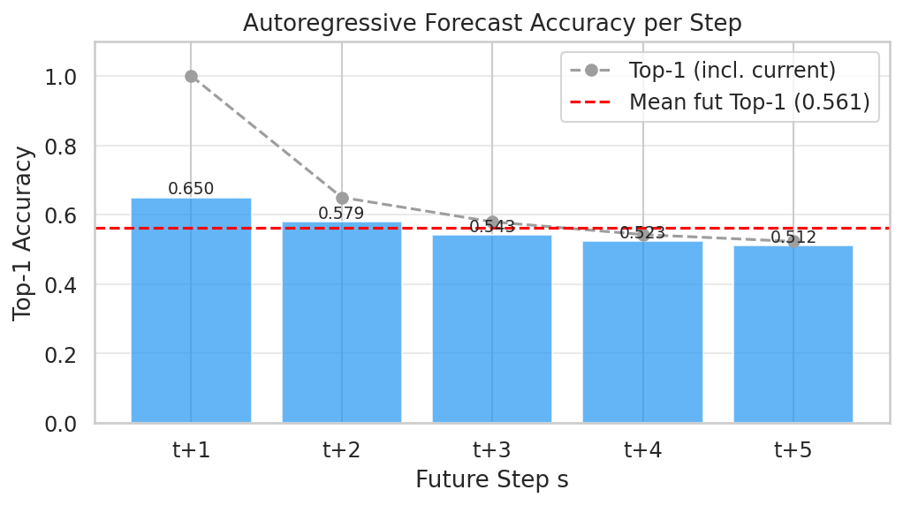

---

## Exp 03 — MTL Set Transformer

> **Notebook:** `notebooks/modeling/03_mtl_transformer.ipynb`  
> **Checkpoint:** `models/best_mtl_transformer.keras`  
> **Loss:** `1.0 × Focal(γ=2.0, α=0.25) + 0.5 × MSE`

The MTL Set Transformer replaces the DeepSet ρ-aggregation with a full multi-head self-attention block over the cell axis. This enables richer cross-cell interaction modeling before the final classification head.

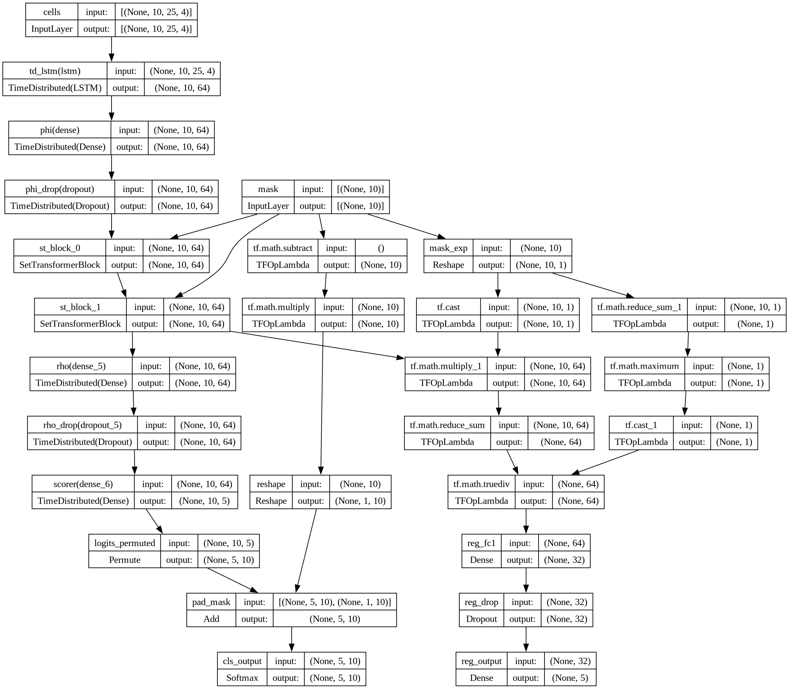

```text
Input: (K, T=25, F=4)   [RSRP, SINR, Load + zero-anchor flag]
    │
    ├─ [Per-Cell LSTM (64)] → φᵢ ∈ ℝ^64
    │
    ├─ [Set Transformer Block × 2]
    │       ├─ Multi-Head Self-Attention (4 heads, key_dim=16)
    │       └─ Feed-Forward (FF_DIM=128)
    │
    ├─ [Cell Classifier Head] → logits ∈ ℝ^K              (5-step)
    │
    └─ [RSRP Regression Head] → predicted RSRP per horizon
```

### Results

| Metric | Value |
|---|---|
| **Test Top-1** | **55.79 %** |
| **Test Top-3** | **86.02 %** |
| **Test Top-5** | **94.99 %** |
| RSRP MAE | 4.20 dBm |

### Training Curves

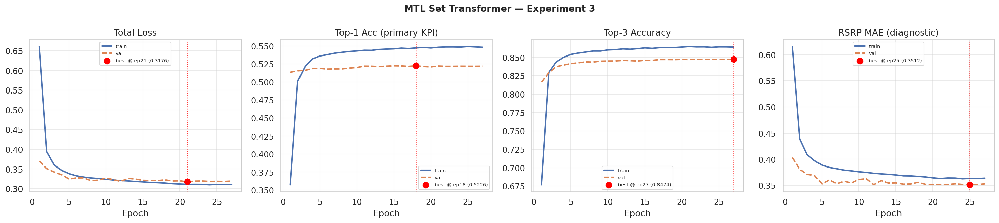

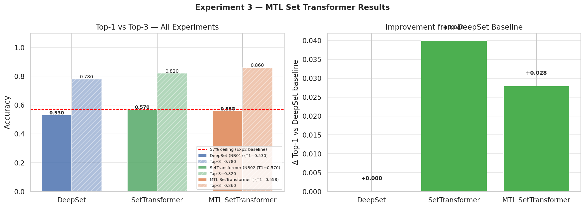

---

## Exp 04 — 6G Predictive Set Transformer

> **Notebook:** `notebooks/modeling/04_6g_predictive.ipynb`  
> **Checkpoint:** `models/best_6g_predictive.keras`  
> **Tuning:** Optuna hyperparameter search

This experiment applies automated Optuna-based hyperparameter optimization over the Set Transformer family, extending the observation window to 200 timesteps to capture long-range temporal dependencies.

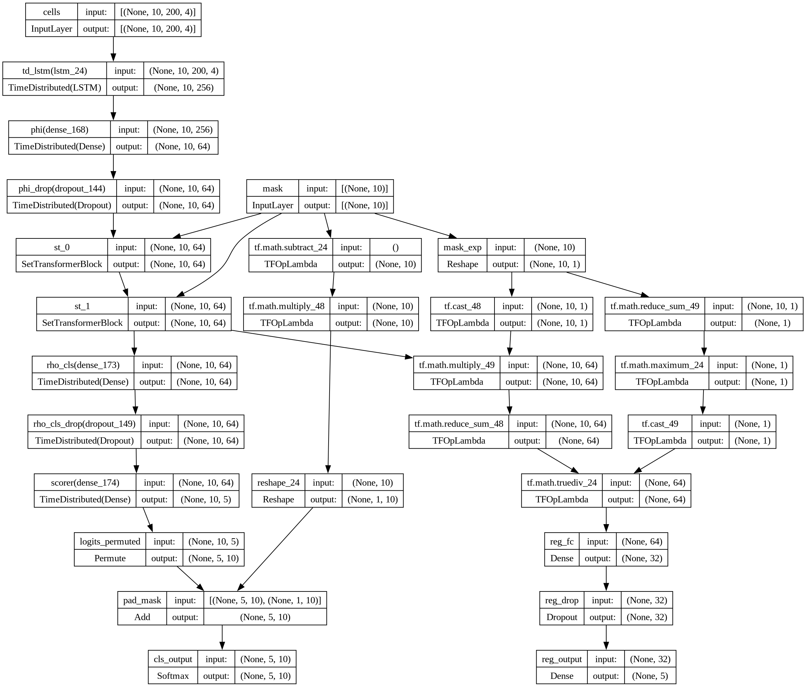

### Hyperparameters (Optuna Best)

| Parameter | Value |
|---|---|
| `OBS_STEPS` | 200 |
| `LSTM_UNITS` | 256 |
| `N_HEADS` | 2 |
| `N_ST_BLOCKS` | 2 |
| `FF_DIM` | 128 |
| `DROPOUT` | 0.378 |
| `LR_INIT` | 1.68e-3 |
| `LAMBDA_CLS` | 1.0 |
| `LAMBDA_REG` | 0.7 |

### Results

| Metric | Value |
|---|---|
| **Test Top-1** | **54.93 %** |
| **Test Top-3** | **85.47 %** |
| **Test Top-5** | **94.70 %** |
| RSRP MAE | 5.23 dBm |

### Training Curves

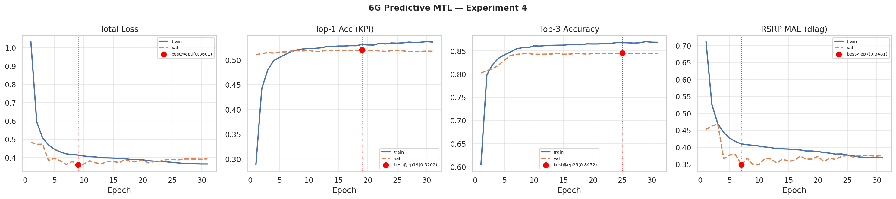

### Confusion Matrix

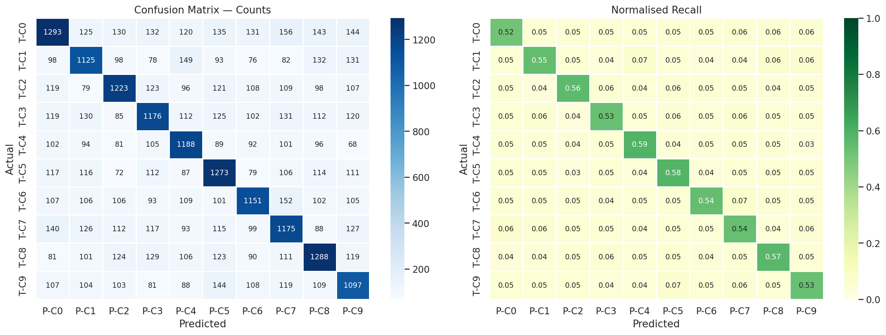

### Comparison Plot

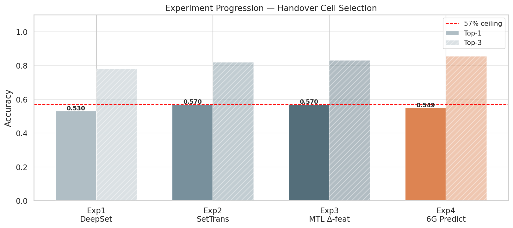

---

## Exp 05 — Strategic DeepSet (Context Injection)

> **Notebook:** `notebooks/modeling/05_strategic_deepset.ipynb`  
> **Checkpoint:** `models/models_deprecated/best_strategic_deepset.keras`  
> **Loss:** `1.0 × Focal(γ=2.0) + 0.5 × Huber`

This experiment injects global contextual state (UE speed, direction cosines, cell load, and one-hot handover class) into the DeepSet aggregation via concatenation. The goal is to make the model context-aware of mobility regime and network state beyond just the RF signal values.

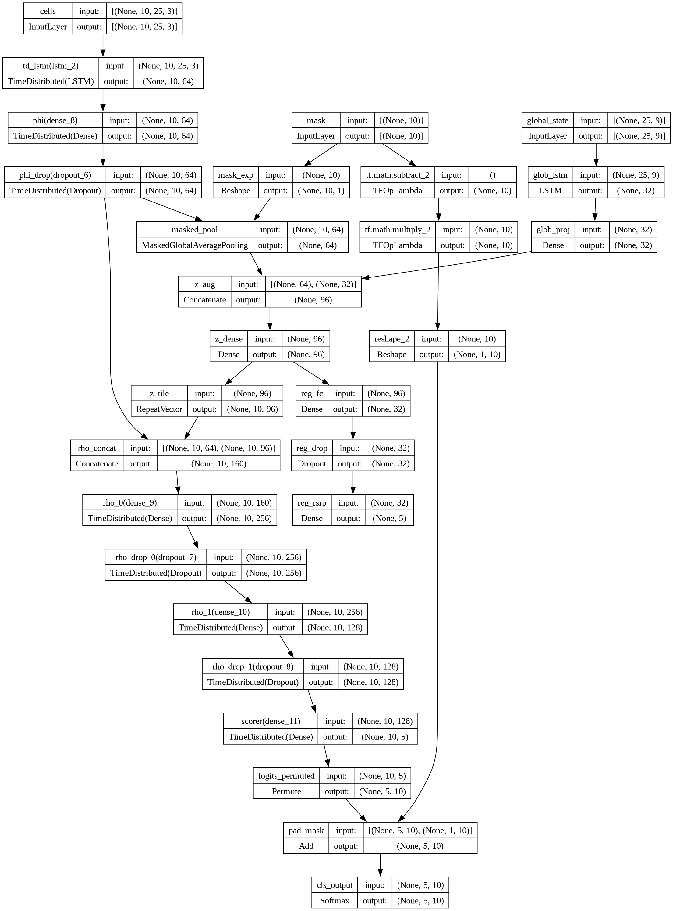

```text
Global Context G = [speed, dir_cos, dir_sin, cell_load, ho_class_onehot]  ∈ ℝ^9
    │
    ├─ [Global LSTM (32)] → global embedding gₜ ∈ ℝ^32
    │
    ├─ [Per-Cell LSTM (64)] → φᵢ ∈ ℝ^64
    │
    ├─ [Concat: φᵢ ‖ gₜ] → enriched cell embedding
    │
    ├─ [RHO MLP (256 → 128)] → aggregated representation
    │
    ├─ [Classifier] → logits ∈ ℝ^K
    │
    └─ [RSRP Regression Head]
```

### Results

| Metric | Value |
|---|---|
| **Test Top-1** | **51.35 %** |
| **Test Top-3** | **86.68 %** |
| **Test Top-5** | **95.59 %** |
| RSRP MAE | 4.94 dBm |

### Training Curves

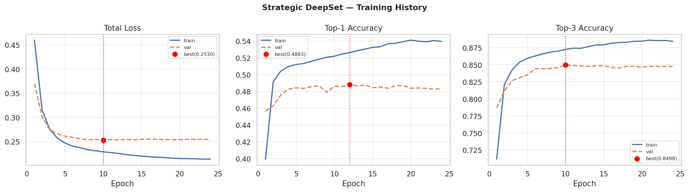

---

## Exp 06 — SOTA Ray-Tracing Fine-Tune

> **Notebook:** `notebooks/modeling/06_sota_ray_tracing_finetuning.ipynb`  
> **Source model:** `models/best_mtl_transformer.keras`  
> **Fine-tuned checkpoint:** `models/best_sota_ray_finetuned.keras`

This experiment adapts the best hexagonal-data model (MTL Transformer) to the high-fidelity ray-tracing domain using a **progressive unfreezing fine-tuning strategy**:

1. **Phase 1 — Head-only** (25 epochs, LR=1e-4): freeze encoder, train classifier head only.
2. **Phase 2 — Upper layers** (25 epochs, LR=5e-5): unfreeze upper transformer blocks.
3. **Phase 3 — Full model** (15 epochs, LR=1e-6): end-to-end fine-tuning.

```text
Base Model (MTL Transformer, frozen encoder)
    │
    Phase 1: train Head only
    Phase 2: unfreeze upper blocks
    Phase 3: full end-to-end
    │
    → Fine-tuned for ray-tracing domain
```

### Results on Ray-Tracing Test Split

| Stage | Top-1 | Top-3 | Top-5 | RSRP MAE |
|---|---|---|---|---|
| Baseline (no FT) | 21.4 % | 63.8 % | 98.3 % | 8.55 dBm |
| **Fine-tuned** | **28.1 %** | **72.5 %** | **98.6 %** | **8.11 dBm** |

### Training Curves

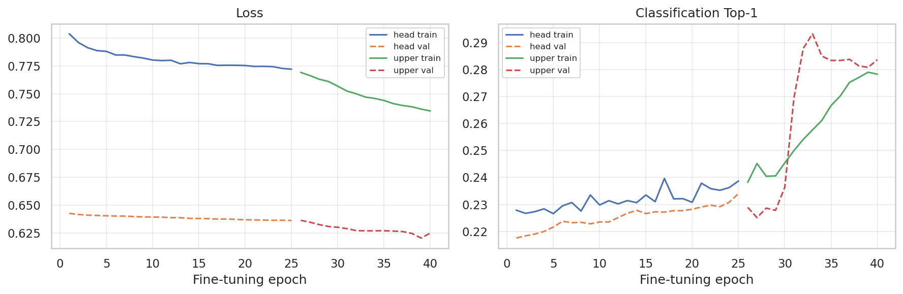

### Confusion Matrix

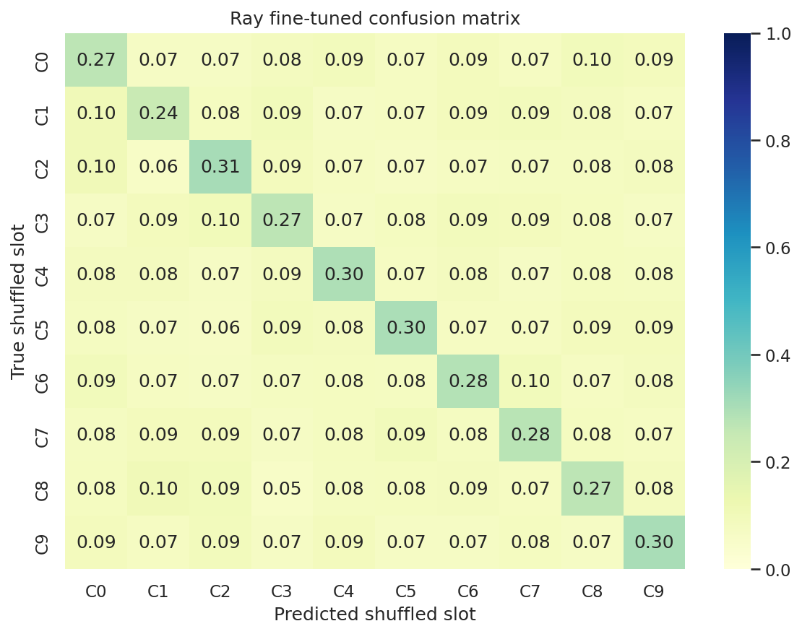

### Occlusion Example

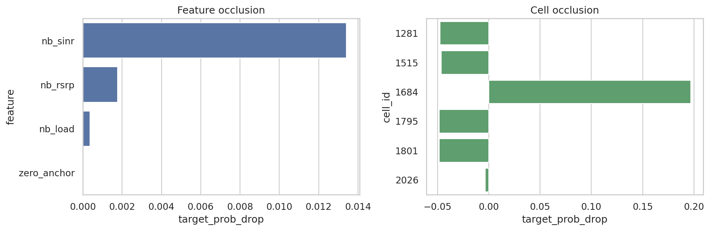

---

## Exp 07 — Ray-ID CrossFormer ★ SOTA / Production

> **Notebook:** `notebooks/modeling/07_ray_id_crossformer.ipynb`  
> **Production checkpoint:** `models/best_ray_id_crossformer.keras`  
> **Deployment target:** NR edge server (MEC)

The Ray-ID CrossFormer is the **state-of-the-art production model**. It combines:
- **Temporal RF encoding** via GRU (per-cell, shared weights),
- **Cell identity embeddings** (learned from integer cell IDs, vocabulary size = 172),
- **Serving-cell flag** embedding (binary: is this cell the current serving cell?),
- **Masked intra-cell self-attention** (attend over the candidate set),
- **Horizon cross-attention** (cross-attend over the 5 future prediction horizons).

```text
Input:
  ├─ RF features   (K, T=25, 3)   [RSRP, SINR, Load]
  ├─ Cell IDs      (K,)            integer cell identifiers
  └─ Serving flag  (K,)            binary serving-cell indicator

Per-Cell Temporal Encoder:
  [GRU (96 units, shared weights)] → hᵢ ∈ ℝ^96

Cell Identity Embedding:
  [Embedding(vocab=172, ID_DIM=32)] → eᵢ ∈ ℝ^32

Serving Embedding:
  [Embedding(2, 8)] → sᵢ ∈ ℝ^8

Fusion:
  [Dense(D_MODEL=128)] ← concat(hᵢ, eᵢ, sᵢ)

Intra-Cell Self-Attention:
  [Multi-Head Self-Attention × 3 blocks, 4 heads, FF=256]  (masked for padding)

Horizon Cross-Attention:
  [Learnable horizon query vectors Q ∈ ℝ^(H×D)]
  [Cross-Attention over cell keys/values]
  → per-horizon logits ∈ ℝ^(H×K)

Output:
  Softmax probabilities per horizon per cell  →  shape (H=5, K)
```

### Hyperparameters

| Parameter | Value |
|---|---|
| `D_MODEL` | 128 |
| `ID_DIM` | 32 |
| `GRU_UNITS` | 96 |
| `N_HEADS` | 4 |
| `FF_DIM` | 256 |
| `N_BLOCKS` | 3 |
| `DROPOUT` | 0.18 |
| `FOCAL_GAMMA` | 1.5 |
| `FOCAL_ALPHA` | 0.75 |
| `LABEL_SMOOTHING` | 0.01 |
| `BATCH_SIZE` | 64 |
| `EPOCHS` | 90 |
| `LR` | 3e-4 |
| `MIN_LR` | 2e-6 |
| `PATIENCE` | 14 |

### Results on Ray-Tracing Domain

| Split | Top-1 | Top-3 | Top-5 |
|---|---|---|---|
| **Validation** | **59.96 %** | **90.86 %** | **98.80 %** |
| **Test** | **57.60 %** | **90.87 %** | **98.87 %** |

> **Top-3 accuracy (90.87 %) is the primary production KPI** — in a live NR network, the RAN can negotiate among the top-3 predicted candidates using X2/Xn signaling, maximising flexibility while dramatically reducing RLF risk. This is the standard operational metric in edge-AI handover pipelines.

### Training Curves

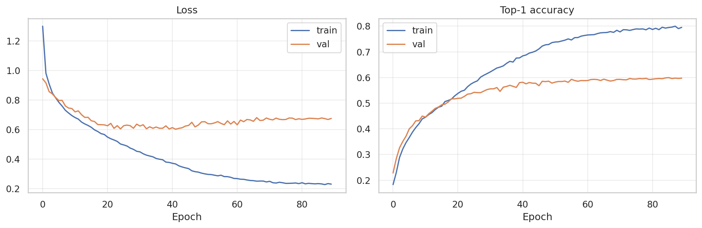

### Confusion Matrix

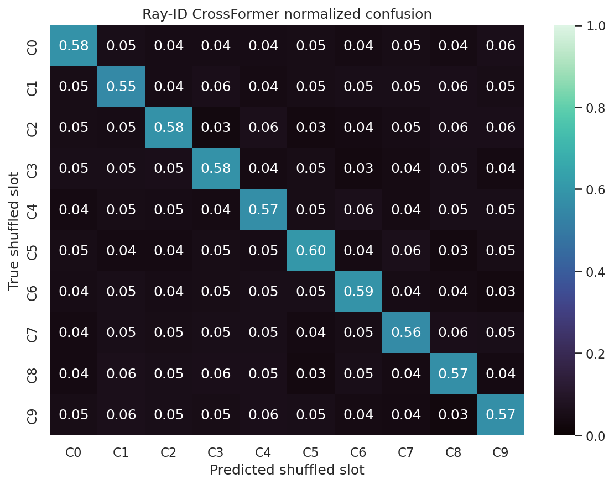

---

## Model Comparison Summary

| Model | Task | Top-1 | Top-3 | Top-5 | RSRP MAE |
|---|---|---|---|---|---|
| Temporal DeepSet (Exp 01) | **Single-step (baseline only)** | 99.82 % | 100.0 % | 100.0 % | — |
| SpatioTemporal DeepSet (Exp 02) | 5-step | 56.13 % (avg) | — | — | 5.56 dBm |
| MTL Transformer (Exp 03) | 5-step | 55.79 % | 86.02 % | 94.99 % | 4.20 dBm |
| 6G Predictive (Exp 04) | 5-step | 54.93 % | 85.47 % | 94.70 % | 5.23 dBm |
| Strategic DeepSet (Exp 05) | 5-step | 51.35 % | 86.68 % | 95.59 % | 4.94 dBm |
| Ray FT (Exp 06) | 5-step (ray domain) | 28.12 % | 72.55 % | 98.57 % | 8.11 dBm |
| **Ray-ID CrossFormer (Exp 07) ★** | **5-step (ray domain)** | **57.60 %** | **90.87 %** | **98.87 %** | — |

> **Note on Top-3 as Production KPI:** In real NR deployments, the network selects from the top-3 candidate cells based on live X2/Xn signaling, QoS constraints, and load balancing. A Top-3 accuracy of **90.87 %** means that in 9 out of 10 handover events, the optimal target cell is within the model's top-3 recommendations — ensuring maximum operational flexibility and near-elimination of blind-handover failures.
