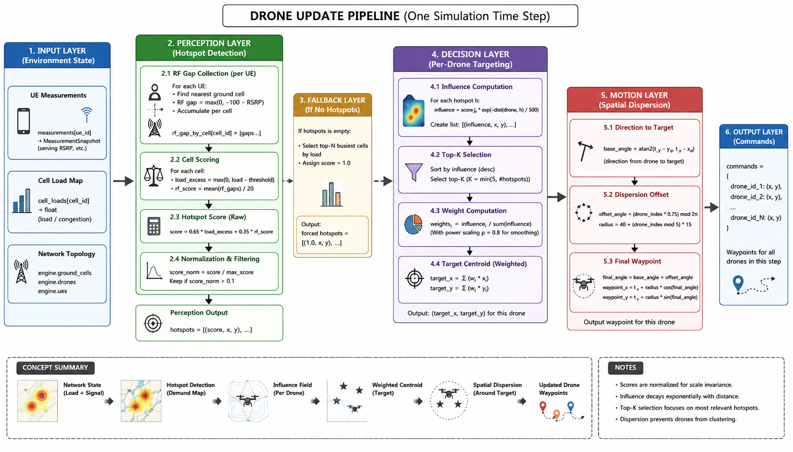
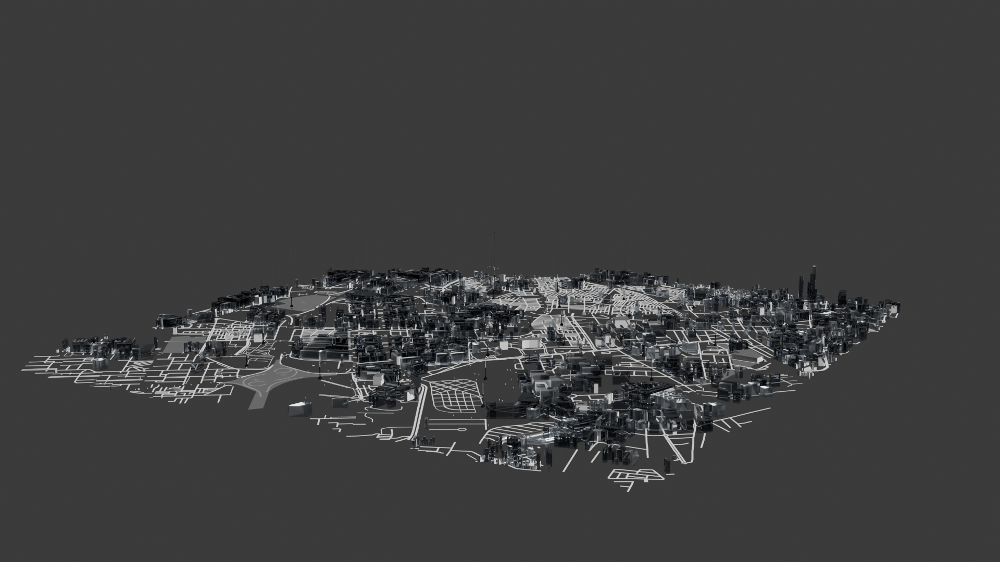
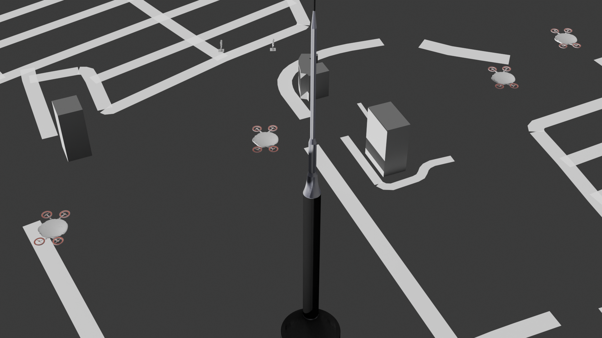
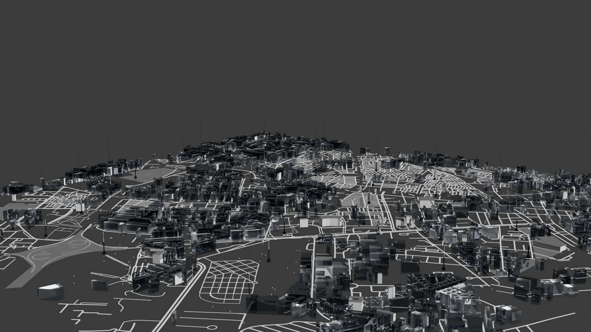
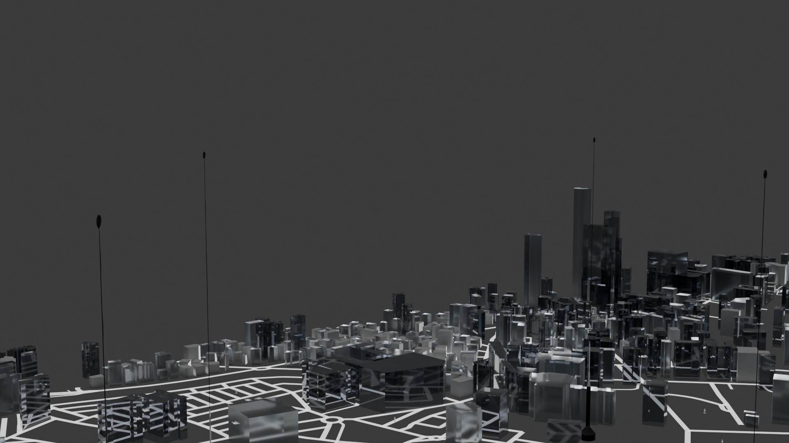
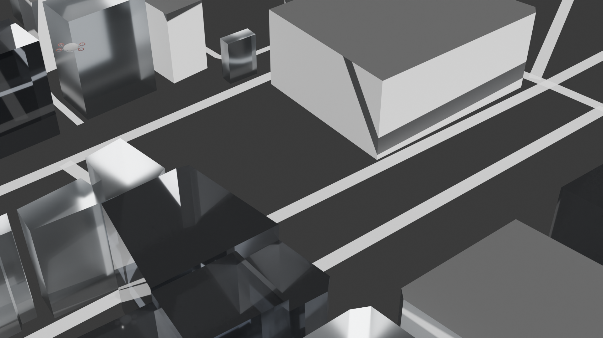
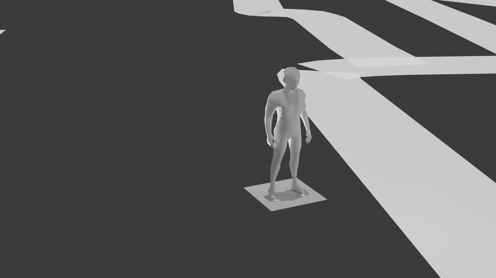

# Dataset Documentation: Geo-Context Aware Predictive Handover Dataset

## 1. Executive Summary

Data generation has been the single most challenging milestone of this project. Evaluating predictive handover cell selection algorithms for 5G NSA-to-6G migration requires a highly specific dataset that combines real geographical context, time-series continuity, dynamic user mobility, and realistic physical layer propagation models capable of handling dual-connectivity.

To achieve this, we developed a novel framework that mirrors a high-density urban environment: **Casablanca Finance City (CFC), Morocco**. The environment leverages real base station coordinates from OpenCellID, maps an E-UTRA-NR Dual Connectivity (EN-DC) architecture, incorporates a custom cell-load aware dynamic UAV drone control loop, and orchestrates user mobility through a hybrid simulation engine. This document charts our iterative journey across four distinct versions, highlighting the failures, bottlenecks, and the final state-of-the-art hybrid pipeline that made robust multi-layer time-series forecasting possible.

---

## 2. Core Simulation Entities & Mechanics

### 2.1. Antenna Densification & Clustering (Real Geo-Context)

To anchor our simulation in reality, we extracted real tower location data from the **OpenCellID database for Morocco**.

* **Target Area Selection:** Through clustering and densification analysis of national tower deployments, **Casablanca Finance City (CFC)** was identified as the optimal location representing a high-density, heterogeneous urban deployment.
* **Pre-processing:** The raw coordinates were cleaned, filtered for 5G NSA (EN-DC) deployment topologies, mapping LTE macro-anchors (Master Nodes) and densified to reflect dense 5G/6G small-cell overlays (Secondary Nodes).

### 2.2. Cell-Load Aware UAV Drone Control System

In addition to ground users, our dataset includes simulated Unmanned Aerial Vehicles (UAVs/Drones) behaving as dynamic antennas. Their movement is not random; it is governed by an automated operational loop:

* **Weighted Centroid Guidance:** Drones track the network's operational conditions. The target trajectory coordinates are determined by calculating a geometric centroid weighted by the real-time **dual-layer cell load** (combining LTE anchor and 5G active resource utilization) of surrounding ground antennas.
* **Distance Penalization:** The control loop applies a penalty function relative to the distance between the drone and active antennas to avoid extreme, energy-inefficient trajectories.
* **Control Formulation:**

$$\mathbf{X}_{uav}(t+1) = f\left( \frac{\sum_{i=1}^{N} L_i(t) \cdot \mathbf{X}_i}{\sum_{i=1}^{N} L_i(t)} - \nabla P(\mathbf{D}) \right)$$

Where $L_i(t)$ represents the aggregate dual-layer cell load of antenna $i$ (MN/SN) at time $t$, $\mathbf{X}_i$ is the antenna position, and $\nabla P(\mathbf{D})$ is the distance-based spatial penalization gradient.



---

## 3. The 4-Stage Iterative Dataset Evolution

The creation of this dataset required overcoming multiple structural failures. Below is the detailed breakdown of the development lifecycle:

```text
[v1: 3GPP Toy Script] ──> [v2: Script + NS3 Sample] ──> [v3: Pure NS3 Engine] ──> [v4: Hybrid Production Pipeline]
     (Too Simple)              (Stats Test Failed)         (Imbalance/CPU Bound)         (Hexagonal + Ray-Tracing)

```

### Version 1: 3GPP Hardcoded Script (Toy Dataset)

* **Methodology:** A standalone Python script designed to output KPI metrics based directly on closed-form 3GPP standard propagation equations for LTE and 5G bands.
* **Bottlenecks & Failures:** The resulting data was entirely deterministic and low-dimensional. It completely lacked the stochastic variance, multi-path fading, interlocking dual-connectivity dependencies, and complex user mobility profiles of real-world networks. It acted as a "toy dataset" and was useless for deep learning.

### Version 2: Hybrid Script + NS3 Sample (Statistical Validation Failure)

* **Methodology:** In an attempt to add realism, we generated a small benchmark sample using the NS-3 (Network Simulator 3) EN-DC network stack and augmented it using our internal Python hardcoded script. We applied rigorous statistical integrity tests (e.g., distribution matching, correlation alignment) to check if the script could scale up the dataset.
* **Bottlenecks & Failures:** **The majority of statistical tests failed.** The Python script was mathematically too simplistic to mimic the intricate, stateful behavior of the NS-3 discrete-event network simulator (such as coupled LTE/5G MAC-layer scheduling overhead, EN-DC bearer splits, and protocol stack delays).

### Version 3: Pure NS-3 Dataset Generation (Imbalance & Compute Bottlenecks)

* **Methodology:** We abandoned the hardcoded scripts and moved the entire simulation infrastructure directly inside **NS-3**.
* **Bottlenecks & Critical Failures:** This version introduced two catastrophic blockers:
1. NS-3 System-Level Abstraction & Artificial Event Sparsity

As a system-level simulator, NS-3 fundamentally relies on abstracted, distance-smoothed statistical propagation models rather than environment-specific physical layer dynamics. Consequently, its simulated RF environment degrades predictably and smoothly. Because the simulation lacks authentic Line-of-Sight (LOS) to Non-Line-of-Sight (NLOS) transitions and sudden urban blockage effects, the signal rarely experienced the steep, realistic drops that trigger dual-connectivity handovers (MN/SN changes) in the real world.

This architectural limitation resulted in an artificially low handover rate (e.g., ~0.7%), meaning handovers only occurred at extreme geometric cell edges. This simulator-induced sparsity created a severe class imbalance in our dataset, rendering traditional machine learning fixes useless:

* Focal Loss: Proved mathematically insufficient to overcome the severe classification bias during gradient descent.

* SMOTE (Synthetic Minority Over-sampling Technique): Proved fundamentally incompatible with our architecture. SMOTE interpolates between isolated feature vectors, which destroys the critical temporal continuity and sequential phase alignment of time-series data. It injected random noise into our signals, rendering sequential models (LSTMs/Transformers) unable to learn true pre-handover degradation signatures.


2. **Computational Complexity ("Time is Gold"):** NS-3 is purely CPU-bound and single-threaded by nature for synchronous event execution. Modeling concurrent LTE and 5G stacks meant a single simulation run took **at least 8 hours**, killing our iteration speed.


### Version 4: The Production Pipeline (Hybrid Framework)

* **Methodology:** Our final breakthrough utilizes a decoupled, multi-engine production pipeline that splits mobility, control loops, and high-fidelity physical layer calculations across specialized tools.

| Layer | Orchestrating Technology | Functional Responsibility |
| --- | --- | --- |
| **Mobility** | NS-3 (Network Simulator 3) | Coordinates ground user trajectories and spatial transitions within the EN-DC footprint. |
| **Control** | Custom Python Engine | Manages the cell-load aware dynamic UAV drone navigation loops. |
| **RF / Signal** | Sionna (GPU-Accelerated) | Executes massive parallel physical layer, fading, and noise calculations across heterogeneous frequencies (LTE and 5G). |

To manage scale, compute costs, and model accuracy, Version 4 is divided into **two structural sub-datasets**:

#### Sub-Dataset A: `hexagonal_simulation`

* **Characteristics:** High-volume, statistical channel modeling.
* **Implementation:** Built using Sionna's **UMIChannel (Urban Micro)** model. It incorporates comprehensive multi-cell co-channel interference modeling for both LTE and 5G layers, fast/slow fading profiles, log-normal shadowing, and thermal noise layers.
* **Purpose:** This dataset serves as the backbone for baseline training, teaching the SOTA neural network architectures generalized macro-temporal dependencies and basic multi-connectivity handover behavior.

#### Sub-Dataset B: `ray_tracing_simulation`

* **Characteristics:** High-fidelity, deterministic, environment-specific modeling.
* **Implementation:** We imported a highly detailed **OpenStreetMap (`.osm`) file of Casablanca Finance City (CFC)** into **Blender**. We manually configured realistic 3D building heights and accurately distributed the three most common urban construction materials across the scene.
* **The Ray-Tracing Pipeline:** This 3D environment was fed into Sionna's GPU-accelerated Ray Tracing engine to simulate real physical interactions (diffraction, specular reflection, and scattering).
* **Purpose (Fine-Tuning Paradigm):** Because ray tracing is computationally expensive, we generate data in small, highly controlled batches. The base model, pre-trained on the large-scale `hexagonal_simulation`, uses this deterministic ray-tracing dataset for **fine-tuning**, allowing it to adapt to real-world geometric multipath anomalies and localized building shadowing profiles.

| Image 1 | Image 2 |
|--------|--------|
|  |  |

| Image 3 | Image 4 |
|--------|--------|
|  |  |

| Image 5 | Image 6 |
|--------|--------|
|  |  |
---

## 4. Time-Series Feature Schema

The final dataset is structured as sliding windows of sequence length $T$, collecting the following key features:

```text
[ t-(T-1) , ... , t-1 , t ]  ───> Predict Target Event at ───> [ t + Δt ]

```

### 4.1. Feature Matrix Specification

1. **Temporal RF Metrics:** Time-series arrays of RSRP, RSRQ, and SINR for both the serving LTE Master Node (MN) and 5G Secondary Node (SN), plus top $N$ neighboring candidate cells for each layer ($T \times 2(N+1)$ matrix dimensions).
2. **Network State Indicators:** Real-time cell load, queue delay profiles, and localized throughput capacities per base station (spanning both LTE anchors and 5G nodes).
3. **Mobility Metrics:** Multi-axis velocity vectors ($v_x, v_y, v_z$) and spatial trajectories of ground users and dynamic UAV centroids.
4. **Target Label:** Explicit handover event vectors marked at time $t + \Delta t$, identifying the optimal target action (e.g., MN Handover or SN Change) while avoiding ping-pong oscillations.