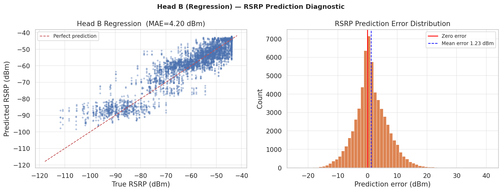
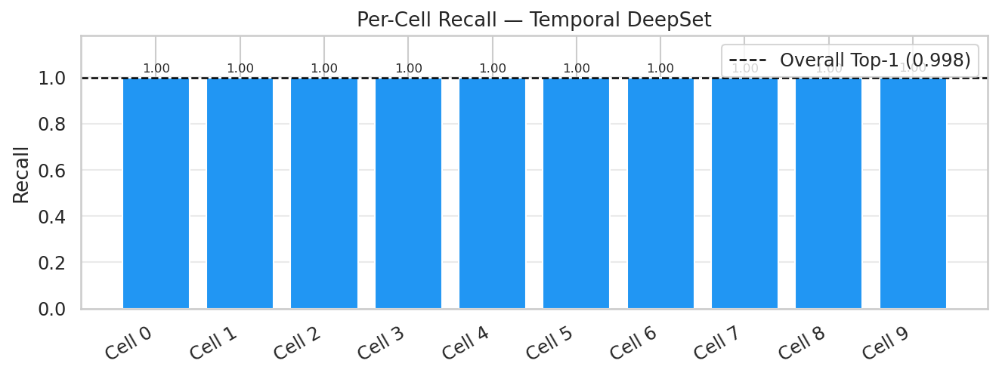

# Training Reference

This page describes the full training methodology applied across the experimentation pipeline: data preprocessing, loss functions, learning rate scheduling, evaluation protocol, and per-experiment training specifics. All **production experiments (Exp 02–07) target 5-step future horizon prediction**. Only Exp 01 is a single-step baseline.

---

## 1. Data Pipeline

### 1.1 Raw Data Sources

| Dataset | Path | Description |
|---|---|---|
| Hexagonal simulation | `dataset/raw/handover_dataset.csv` | Large-scale UMi channel model dataset (primary training corpus) |
| Ray-tracing simulation | `dataset/raw/handover_dataset_ray_tracing.csv` | High-fidelity ray-tracing dataset (fine-tuning / Exp 06–07) |

### 1.2 UE-Level Train/Val/Test Split

All experiments use a **UE-level split** loaded from `dataset/processed/ue_split.json`. This prevents temporal leakage — a UE's data appears in exactly one partition. Typical split ratios are 70/15/15.

```python
# UE-level split prevents time leakage across train/val/test
with open("dataset/processed/ue_split.json") as f:
    ue_split = json.load(f)
    train_ues = ue_split["train"]   # ~70% of UE trajectories
    val_ues   = ue_split["val"]     # ~15%
    test_ues  = ue_split["test"]    # ~15%  ← never seen during training
```

### 1.3 Sliding Window Construction

Each sample is a sliding window of `OBS_STEPS` consecutive timesteps (sampled every 200 ms):

```text
[ t-(T-1)  ...  t-1  t ]  ──►  Predict optimal cell at  [ t+1, t+2, t+3, t+4, t+5 ]
```

The window shape is `(K, T, F)`:
- `K = MAX_CELLS = 10` — padded candidate cell set
- `T = OBS_STEPS` — 25 or 200 timesteps depending on experiment
- `F` — feature count (3–5 depending on experiment)

### 1.4 Neighbor-Axis Shuffling (Anti-Leakage)

A critical anti-leakage measure is applied to **every sample**: the `K` candidate cells are randomly permuted before caching, and the label is remapped accordingly. This prevents the model from learning the trivial shortcut of "index 0 is always optimal" (which was an artefact of score-sorted raw CSVs).

```python
# Applied per window in all production experiments
perm  = rng.permutation(MAX_CELLS)
X     = X[perm]          # (K, T, F) shuffled
label = inv_perm[label]  # label index remapped after shuffle
```

### 1.5 Feature Schema

| Feature | Description | Included in |
|---|---|---|
| `nb_rsrp` | Neighbor cell RSRP (dBm) | All experiments |
| `nb_sinr` | Neighbor cell SINR (dB) | All experiments |
| `nb_load` | Neighbor cell load (0–1) | All experiments |
| `zero_anchor` | LTE anchor serving-flag | Exp 03, 04, 06 |
| `speed / dir_cos / dir_sin` | UE mobility state | Exp 05 |
| Cell ID integers | Discrete cell identifiers | Exp 07 (ID embedding) |

---

## 2. Loss Functions

### 2.1 Focal Loss

All classification heads use Focal Loss to handle class imbalance across the 172 candidate cells:

$$\mathcal{L}_{\text{focal}}(p_t) = -\alpha_t (1 - p_t)^\gamma \log(p_t)$$

Where:
- $\alpha$ focuses on the minority class (positive handover events)
- $\gamma$ down-weights easy (well-classified) samples

| Experiment | γ | α |
|---|---|---|
| Exp 01–05 | 2.0 | 0.25 |
| Exp 06 (fine-tune) | 2.0 | 0.25 |
| **Exp 07 (CrossFormer)** | **1.5** | **0.75** |

### 2.2 Auxiliary Regression Loss (Huber / MSE)

Multi-task experiments (03, 04, 05) add a signal regression head with a Huber or MSE loss:

$$\mathcal{L}_{\text{total}} = \lambda_{\text{cls}} \cdot \mathcal{L}_{\text{focal}} + \lambda_{\text{reg}} \cdot \mathcal{L}_{\text{huber}}$$

| Experiment | λ_cls | λ_reg |
|---|---|---|
| Exp 03 | 1.0 | 0.5 |
| Exp 04 | 1.0 | 0.7 |
| Exp 05 | 1.0 | 0.5 |

### 2.3 Label Smoothing

Applied to the classification target to regularise overconfident predictions:

| Experiment | Label Smoothing |
|---|---|
| Exp 01 | 0.10 |
| Exp 02 | 0.10 |
| Exp 06 (fine-tune) | 0.02 |
| **Exp 07 (CrossFormer)** | **0.01** |

---

## 3. Learning Rate Scheduling

### 3.1 Warmup + Cosine Decay (Exp 01–06)

A linear warmup phase is followed by cosine decay, providing stable early-epoch convergence and smooth annealing:

```text
Epochs 0 → LR_WARMUP_EP  : linear ramp from 0 → LR_INIT
Epochs LR_WARMUP_EP → LR_DECAY_EP : cosine decay to LR_MIN
Epochs LR_DECAY_EP → EPOCHS : flat at LR_MIN
```

| Experiment | LR_INIT | Warmup Epochs | Decay Epochs | Total Epochs |
|---|---|---|---|---|
| Exp 01 | 1e-3 | 4 | 20 | 60 |
| Exp 02 | 1e-3 | 4 | 20 | 60 |
| Exp 03 | 1e-3 | 4 | 20 | 60 |
| Exp 04 (Optuna) | 1.68e-3 | 5 | 25 | 60 |
| Exp 05 | 5e-4 | 4 | 20 | 60 |

### 3.2 ReduceLROnPlateau + EarlyStopping (Exp 07 — CrossFormer)

The Ray-ID CrossFormer uses a simpler ReduceLROnPlateau callback with early stopping, more appropriate for the smaller ray-tracing dataset:

```python
ReduceLROnPlateau(monitor='val_loss', factor=0.5, patience=7, min_lr=2e-6)
EarlyStopping(monitor='val_top3_accuracy', patience=14, restore_best_weights=True)
```

| Parameter | Value |
|---|---|
| Initial LR | 3e-4 |
| Min LR | 2e-6 |
| Patience (early stop) | 14 |
| Total epochs | 90 |

---

## 4. Training Infrastructure

### 4.1 Hardware & Framework

| Item | Detail |
|---|---|
| Framework | Keras 3 / TensorFlow 2.x backend |
| Mixed precision | `float16` compute, `float32` weights (GPU) |
| Dataset API | `tf.data.Dataset` pipeline pinned to CPU |
| Experiment tracking | MLflow (`mlflow/mlruns/`) |
| TensorBoard logs | `tb_logs/<experiment>/` |

### 4.2 Dataset Caching

All experiments pre-build a numpy cache to avoid repeated windowing:

```text
dataset/
├── temporal_deepset_cache/          # Exp 01
├── temporal_deepset_production_cache/ # Exp 02
├── mtl_cache/                       # Exp 03
├── 6g_cache/                        # Exp 04
├── strategic_cache/                 # Exp 05
├── ray_tracing_finetune_cache/      # Exp 06–07
└── processed/ue_split.json          # shared UE split
```

### 4.3 Callbacks

Every experiment uses the following standard callback set:

```python
ModelCheckpoint(filepath='models/best_<exp>.keras',
                monitor='val_top3_accuracy',    # primary monitor
                save_best_only=True)
TensorBoard(log_dir='tb_logs/<exp>/')
CSVLogger('metrics/<exp>/training_log.csv')
```

> **`val_top3_accuracy` as the checkpoint monitor** — Top-3 accuracy is used as the primary validation monitor because it is the most operationally relevant metric in production. The NR network uses the top-3 predicted candidates for X2/Xn preparation, so optimising for Top-3 directly aligns training with deployment objectives.

---

## 5. Experiment Training Details

### Exp 01 — Temporal DeepSet (Single-Step Baseline)

> ⚠️ This is the **single-step selection** experiment. The model predicts the best current cell. It is used as a **proof-of-concept baseline** and was the first modeling experimentation in this project. All subsequent experiments solve the harder 5-step future prediction problem.

```bash
conda run -n tda-handover python src/train_model.py --label optimal
```


### Exp 02 — SpatioTemporal DeepSet Production

First transition to **5-step multi-horizon** prediction. Uses a long 200-timestep observation window (40 seconds of history at 200 ms resolution) and a multi-task loss combining future cell classification and signal regression.


### Exp 03 — MTL Set Transformer

Introduces self-attention over the cell dimension. RSRP regression diagnostic:




### Exp 04 — 6G Predictive (Optuna-Tuned)

Optuna runs 50 trials with Tree-structured Parzen Estimator (TPE) sampler to find optimal `LSTM_UNITS`, `N_HEADS`, `DROPOUT`, and `LR_INIT`. Best epoch: 19.


### Exp 05 — Strategic DeepSet (Context Injection)

Injects global UE context (`speed`, `dir_cos`, `dir_sin`, `cell_load`, `ho_class_onehot`) into the cell aggregation to make the model mobility-regime-aware.


### Exp 06 — Ray-Tracing Fine-Tune (Progressive Unfreezing)

Three-phase progressive fine-tuning on the ray-tracing domain. Uses a temperature-scaled calibration (T=1.1) post-training.

```text
Phase 1 (25 ep, LR=1e-4): head only   → val top-3 ↑
Phase 2 (25 ep, LR=5e-5): upper blocks → continued improvement
Phase 3 (15 ep, LR=1e-6): full model  → final adaptation
```


### Exp 07 — Ray-ID CrossFormer (SOTA / Production)

The production training run. Trained directly on the ray-tracing cache with cell-ID embeddings. Converges in ~60–70 effective epochs under early stopping.

```bash
# Training (from project root, inside the tda-handover conda env)
conda run -n tda-handover python -m notebooks.modeling.07_ray_id_crossformer
```


---

## 6. Evaluation Protocol

### 6.1 Metrics

| Metric | Formula | Role |
|---|---|---|
| **Top-1 Accuracy** | $\Pr[\hat{y}_1 = y]$ | Exact match — hardest metric |
| **Top-3 Accuracy** | $\Pr[y \in \{\hat{y}_1, \hat{y}_2, \hat{y}_3\}]$ | **Primary production KPI** |
| **Top-5 Accuracy** | $\Pr[y \in \text{top-5}]$ | Coverage ceiling |
| RSRP MAE (dBm) | $E[|\hat{r}-r|]$ | Regression quality (auxiliary) |
### 6.2 Why Top-3 Is the Primary Production Metric

In a live 5G NR deployment, the edge-AI inference does not issue a single hard handover command. Instead, it returns a **ranked candidate list** to the RAN controller (via X2/Xn interface), which then selects the best reachable candidate based on:
- live X2/Xn resource availability,
- QoS profile matching,
- load constraints on the candidate cell.

This means the network can exploit the **top-3 predicted candidates**, not just the single best prediction. A Top-3 accuracy of **90.87 %** (CrossFormer) means the optimal target cell is presented in the candidate shortlist in 9 out of 10 handover events, essentially eliminating blind handover failures in production.

### 6.3 Evaluation Script

```bash
# Evaluate CrossFormer on ray-tracing test split
conda run -n tda-handover python src/evaluate_model.py \
  --model models/best_ray_id_crossformer.keras \
  --label optimal
```

### 6.4 Per-Cell Recall

Per-cell recall plots expose which cells are systematically confused — useful for identifying coverage holes, highly loaded cells, or geo-clusters with ambiguous candidates:



---

## 7. Production Source Modules

The `src/production/` directory contains reusable Python modules that mirror notebook logic in a script-friendly, reproducible form:

| Module | Description |
|---|---|
| `src/production/temporal_deepset_data.py` | Windowed cache builder + scaler for DeepSet experiments |
| `src/production/temporal_deepset_model.py` | Keras model builder + loader (with custom `MaskedGlobalAveragePooling`) |
| `src/production/temporal_deepset_decision.py` | TTT + margin + cooldown stability gate |
| `src/production/mh_transformer_data.py` | Multi-horizon cache builder for transformer experiments |
| `src/production/mh_transformer_model.py` | Multi-horizon transformer model builder |
| `src/train_model.py` | Train TemporalDeepSet (single-step baseline) |
| `src/train_mh_transformer.py` | Train multi-horizon transformer |
| `src/evaluate_model.py` | Evaluate and write metrics JSON |
| `src/inference.py` | Offline streaming inference + stability gate |

> **Inference entry point uses `models/best_ray_id_crossformer.keras`** as the default production model. The `src/inference.py` script runs per-UE rolling-window inference with the stability gate (TTT=3 steps, margin=0.15, cooldown=5 steps).
